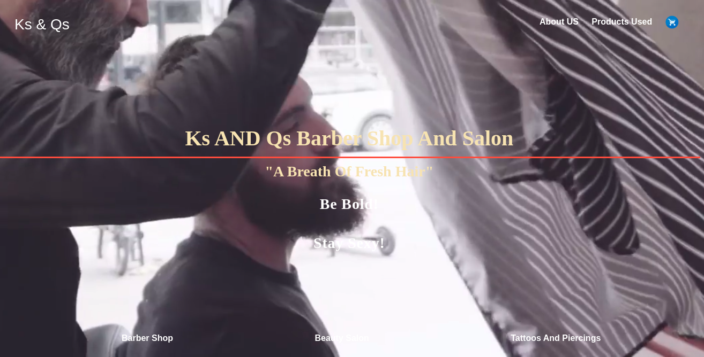

# Week 5 Group Project
<<<<<<< Updated upstream
By Angie Wambui, David Kiriago, Linsy Kipruto, Naftaly Muiruri and Daniel Githiomi
=======
 By Angie Wambui, David Kiriago, Linsy Kipruto, Naftaly Muiruri and Daniel Githiomi
>>>>>>> Stashed changes

 Ks and Qs cuts is an interactive website that implements all the week's knowledge of the following areas; HTML, CSS and Java Script. It also incrporates my creative ability by addition of a few animations and transitions

 Created By Angie Wambui, David Kiriago, Linsy Kipruto, Naftaly Muiruri and Daniel Githiomi

## Screenshots

  

## Description
Ks and Qs cuts is an enticing website that enticed the user to become part of the Ks and Qs cuts Community through its beautiful design that appeals to the eye of the user. This is a pizza website that allows the users order the style of hair they need specify the nature of products,choose the barber or salonist and see the prices for the orders.

## Setup/Installation Requirements
* i5 Core
* 6GB RAM
* 1TB Internal storage 

## Compatibility

  Compatible with all browsers.
  further updates on the way. 

## Technologies Used
It is made completly using sublime Text 3 where all the following files were created and modified until the output is as you see it.
* HTML 5
* CSS, Bootstrap
* Javascript
* JQuery

## Known Bugs
No bugs to report at the moment! the system works efficiently at 100% guaranteed. Feel free to search the output on googl to ensure that it coincides exactly.

## Link to live page
[This is my link to live pages] (https://github.com/githiomi/Ks-And-Qs)

## Setup Instructions
* git clone [This] (https://github.com/githiomi/Ks-And-Qs) into your terminal. 
* Navigate to the Week-4-IP folder through cd Documents/Desktop/moringa/Week-5/Ks-And-Qs. 
* Open the folder in your favourite editor,for vscode,is code . and for atom, atom . 
* Open the index.html in your browser.

## Support and contact details
Contact us through any of the following:

* Email: danielgithiomi@gmail.com
* Email: davidneymar21@gmail.com
<<<<<<< Updated upstream
* Email: muirurigathairu@gmail.com
* Email: angiewambui@gmail.com
* Email: totoro15spain@gmail.com
=======
* Email: naftalymuiruri@gmail.com
* Email: 
>>>>>>> Stashed changes

### License
Click the following to acces the license page: [Click-Here] (https://github.com/githiomi/license/blob/master/LICENSE)

Copyright (c) {2020} Dhosio Co.
